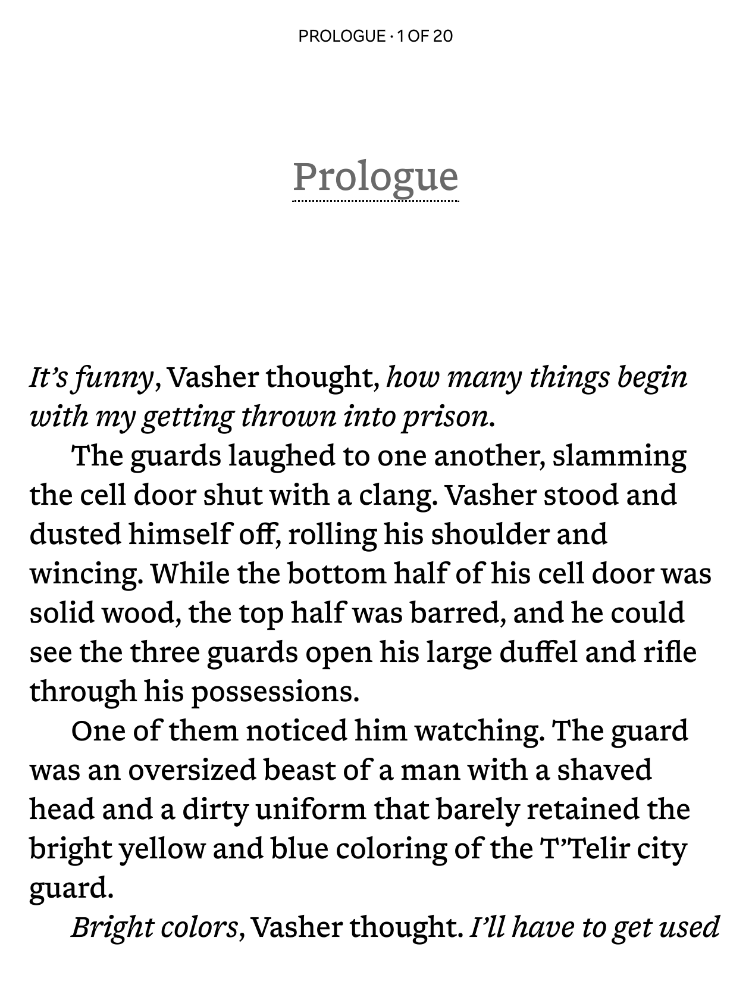

# Readerly

**Readerly** is modified font based on [Newsreader](https://github.com/productiontype/Newsreader), while attempting to be metrically very similar to [Bookerly](https://en.wikipedia.org/wiki/Bookerly), the default font on Kindle devices, to provide a similar reading experience.

<kbd></kbd>

When I was doing my usual font tweaking for my [ebook-fonts](https://github.com/nicoverbruggen/ebook-fonts) repository, I stumbled upon variable fonts exporting. Doing this for Newsreader gave me some interesting results at small optical sizes: the font was now reminding me of Bookerly.

I asked myself the question: how close can we get to the metrics of Bookerly while still retaining Newsreader and keeping the font licensed under the OFL, and maybe making some mild manual edits?

The goal was to get a metrically/visually similar font, without actually copying glyphs or anything that would infringe upon the rights of the original creators; after all, Newsreader is a very beautiful font as a starting point.

To get to the final result, I decided to use the variable font and work on it. The original is located in `src` and is available under the same OFL as the end result, which is included in `LICENSE`.

## Project structure

- `src`: Newsreader variable font TTFs
- `build.py`: The build script to generate Readerly
- `LICENSE`: The OFL license
- `COPYRIGHT`: Copyright information, later embedded in font
- `VERSION`: The version number, later embedded in font

After running `build.py`, you should get:

- `out/sfd`: FontForge source files (generated)
- `out/ttf`: final TTF fonts (generated)

## Prerequisites

- **Python 3**
- **[fontTools](https://github.com/fonttools/fonttools)** — install with `pip install fonttools`
- **[FontForge](https://fontforge.org)** — the build script auto-detects FontForge from PATH, Flatpak, or the macOS app bundle

### Linux preparation

```
pip install fonttools
flatpak install flathub org.fontforge.FontForge
```

### macOS preparation

On macOS, if you're using the built-in version of Python (via Xcode), you may need to first add a folder to your `PATH` to make `font-line` available, like:

```bash
echo 'export PATH="$HOME/Library/Python/3.9/bin:$PATH"' >> ~/.zshrc
brew install fontforge
brew unlink python3 # ensure that python3 isn't linked via Homebrew
pip3 install fonttools font-line
source ~/.zshrc
```

## Building

```
python3 build.py
```

To customize the font family name, disable old-style kerning, or skip outline fixes:

```
python3 build.py --customize
```

The build script (`build.py`) uses `fontTools` and FontForge to transform the Newsreader variable fonts into Readerly. Configuration and step-by-step details live in the header comments of `build.py`.
